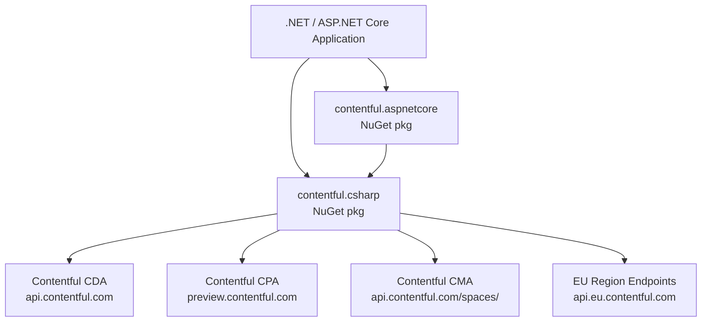

# Architecture

<!-- Generated by seed-golden-context | Last updated: 2026-05-11 -->

## Overview

`contentful.net` is the official .NET SDK for Contentful's Content Delivery API (CDA), Content Preview API (CPA), and Content Management API (CMA). It is a publish-and-forget library distributed as two NuGet packages — `contentful.csharp` (core client) and `contentful.aspnetcore` (ASP.NET Core integration) — targeting `netstandard2.0` for maximum cross-platform compatibility.

## System Context

Consumer applications pass in an `HttpClient` (or rely on DI via the ASP.NET Core package) and receive typed C# objects back from Contentful's REST APIs.

## Internal Structure

| Directory / Project | Purpose |
|---|---|
| `Contentful.Core/` | Core SDK — `ContentfulClient` (CDA/CPA), `ContentfulManagementClient` (CMA), models, search query builder, error types |
| `Contentful.Core/Models/` | C# representations of Contentful resource types (Entry, Asset, ContentType, Space, SyncResult, Taxonomy, etc.) |
| `Contentful.Core/Models/Management/` | CMA-specific models |
| `Contentful.Core/Search/` | `QueryBuilder<T>` and related helpers for building CDA query strings |
| `Contentful.Core/Errors/` | Typed exceptions (`ContentfulException`, `ContentfulRateLimitException`, `GatewayTimeoutException`) |
| `Contentful.Core/Extensions/` | `ExpressionHelpers`, `FieldHelpers`, JSON conversion helpers |
| `Contentful.Core/Images/` | Image transformation URL builder |
| `Contentful.AspNetCore/` | ASP.NET Core integration — `IServiceCollectionExtensions` (DI registration), Tag Helpers, Middleware, Authoring utilities |
| `Contentful.Core.Tests/` | Unit tests for core SDK |
| `Contentful.AspNetCore.Tests/` | Unit tests for ASP.NET integration |

## Data Flow

1. **Read path (CDA/CPA):** Caller builds an optional `QueryBuilder<T>` → passes to `ContentfulClient` method → client serializes to query string → `HttpClient` makes authenticated GET → JSON response → `Newtonsoft.Json` deserializes into caller-provided generic type `T` → returned to caller.
2. **Write path (CMA):** Caller constructs a model object → calls `ContentfulManagementClient` method → client serializes to JSON → `HttpClient` makes authenticated POST/PUT/PATCH/DELETE → JSON response or version header captured → returned to caller.
3. **Rate limiting:** Built-in retry logic on `429` responses — waits the number of seconds specified by the `X-Contentful-RateLimit-Reset` response header before retrying (fixed-interval, server-driven). `ContentfulRateLimitException` is thrown immediately if `MaxNumberOfRateLimitRetries` is `0`, or after the retry budget is exhausted.
4. **Sync:** `SyncInitial` / `SyncNextResult` methods traverse Contentful's sync API and return `SyncResult` with full and delta payloads.

## Key Dependencies

| Dependency | Why it's here |
|---|---|
| `Newtonsoft.Json` 13.0.1 | JSON serialization/deserialization. .NET Standard 2.0 era choice; predates `System.Text.Json`. See [ADR-002](./docs/ADRs/002-newtonsoft-json.md) |
| `Microsoft.CSharp` 4.7.0 | Dynamic type support for `Entry<dynamic>` patterns |
| `Microsoft.AspNetCore.*` (AspNetCore project) | ASP.NET Core Tag Helpers, Middleware, DI extensions |
| `Microsoft.Extensions.DependencyInjection` 6.0.0 | Options pattern integration for `ContentfulOptions` |
| `Microsoft.Extensions.Http` 6.0.0 | `IHttpClientFactory` support in DI setup |

## Configuration

| Option / Flag | Purpose | Default |
|---|---|---|
| `DeliveryApiKey` | CDA access token | — (required) |
| `PreviewApiKey` | CPA access token | — (optional) |
| `ManagementApiKey` | CMA access token | — (optional) |
| `SpaceId` | Contentful space identifier | — (required) |
| `UsePreviewApi` | Route reads to the Preview API endpoint | `false` |
| `DirectApiUrl` | Override the CMA base URL for non-space-scoped endpoints (`/users/me`, `/organizations/`, `/taxonomy/`, etc.) — used only by `ContentfulManagementClient` | `https://api.contentful.com/` |
| `ManagementBaseUrl` | Override the CMA base URL (e.g., EU region) | `https://api.contentful.com/spaces/` |
| `Environment` | Target a non-default Contentful environment | `master` |
| `MaxNumberOfRateLimitRetries` | Retry budget for rate-limit responses | `0` (no retries by default) |

## Integration Points

### Upstream (this repo consumes)

- **Contentful CDA** (`cdn.contentful.com` / `api.eu.contentful.com`) — read-only content delivery
- **Contentful CPA** (`preview.contentful.com`) — unpublished content preview
- **Contentful CMA** (`api.contentful.com/spaces/`) — content management (create, update, publish, delete)

### Downstream (consumes this repo)

- Any .NET / ASP.NET Core application that needs Contentful content — installed via NuGet as `contentful.csharp` or `contentful.aspnetcore`
- Contentful's official .NET documentation and tutorials at https://www.contentful.com/developers/docs/net/
